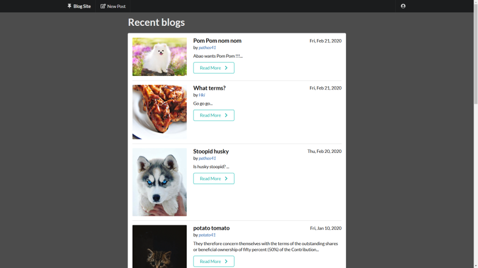

# RESTfulBlogApp
Visit the website at <a href="https://pathos41-blog.herokuapp.com/">pathos41-blog</a>.

A simple blog app using node.js, mongodb and RESTful routing.

Expressjs is used as framework for node.js, and MongoDB is used as database.

Use Mongoose to connect the application to MongoDB Atlas.

Apply RESTful routing in conjunction with method-override to define 7 different routes.

Semantic UI is utilized for styling.

Ejs templates are used, and all the static files are stored under "/public" directory

Use express-sanitizer to avoid any script injection.

Passport and Express-session are used for user authentication.

Local strategy is used for passport, and passport-local-mongoose is used as a Mongoose plugin for simplicity.

How to use:

The single blog page when user is not logged in and Read More button is clicked.

The login page.

The signup page.

The single blog page when user is logged in, Edit and Delete buttons are available once logged in.

Edit the chosen blog post, user has to be logged in.

Create a new post, user has to be logged in.

View the blogs posted by a specific author.

  
